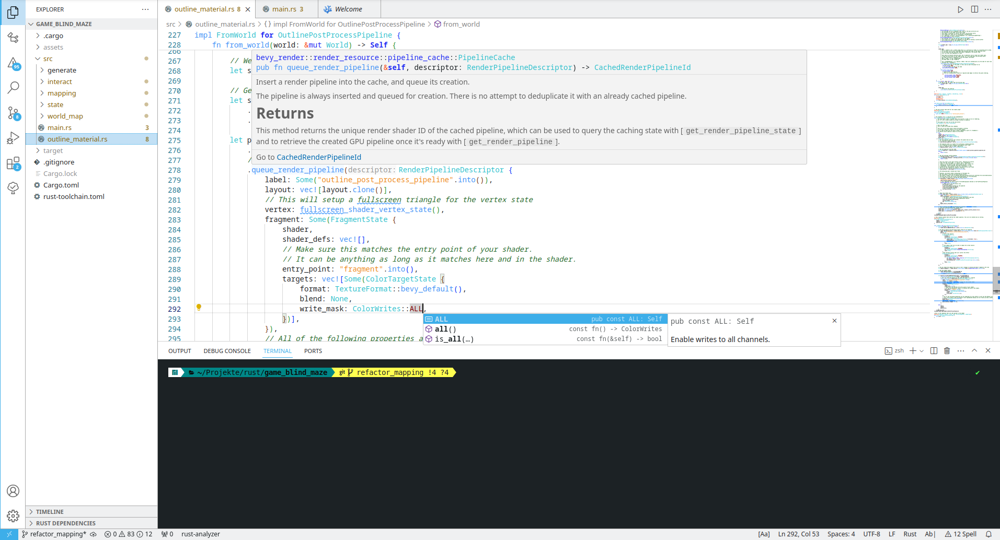

# Xanthron Light - VS Code Light Theme

Xanthron Light is a light theme designed for Visual Studio Code, meticulously crafted to provide an eye-pleasing coding experience. Drawing inspiration from the KDE Breeze Theme, this theme brings a touch of elegance and familiarity to your workspace.

## Eye-Pleasing Design

Xanthron Light is carefully crafted with a delightful color scheme and balanced contrast, providing an aesthetically pleasing environment for coding. Its harmonious design enhances focus and creates a visually appealing workspace, making coding sessions enjoyable and productive.

## Inspired by KDE Breeze

The menu colors in Xanthron Light are directly inspired by the KDE Breeze Theme, offering a seamless integration with your coding environment. Experience the elegance and coherence of the KDE design philosophy within Visual Studio Code.

## Screenshot

## Tested and Optimized

Xanthron Light has been thoroughly tested and optimized to ensure compatibility and performance. While it's designed with a focus on aesthetics, it also provides a functional and efficient coding experience across various programming languages and workflows.

## Installation

1. Open Visual Studio Code.
2. Go to the Extensions view by clicking on the square icon in the sidebar.
3. Search for "Xanthron Light" and click install.
4. Once installed, select "Xanthron Light" from the Color Theme dropdown in the Preferences menu (Ctrl+Shift+P > Preferences: Color Theme).

## Feedback

If you have any suggestions, feedback, or issues, feel free to [open an issue](https://github.com/XanthronWriter/vscode-theme-xanthron-light.git) on the GitHub repository.

Enjoy coding with Xanthron Light! Happy coding! 🎉
